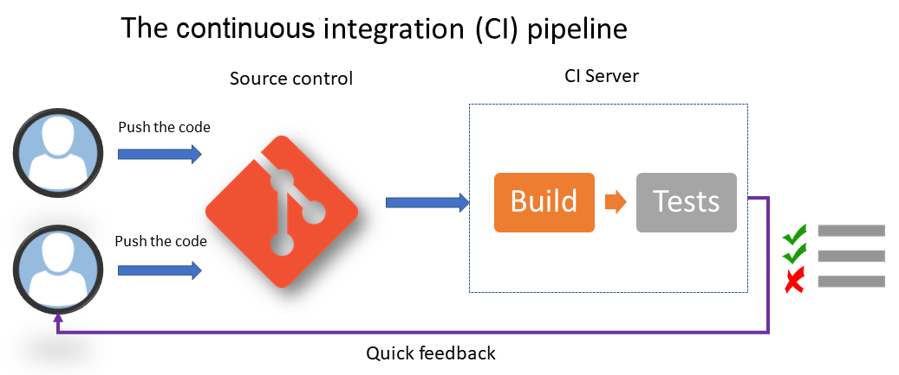

# Section 1 
## Chatpter 1  :- (DevOps Culture and Practices)

#### Important Abbreviation and Concepts

Abbreviation | Stands for
------------ | -------------
DevOps | Content from cell 2
CI | Continuous Integration
CD | Continuous Delivery
IaC | Infrastructure as Code
BDD | Behavior Driven Design
TDD | Test Driven Desgin
SCM | Source Code Manager
TFVC | Team Foundation Source Control
PaaS | Platform as a Service

  
   * **DevOps** : "DevOps is the union of people, process, and products to enable continuous delivery of value to our
   end users"[1].
  
   * **CI** : "Continuous Integration is a software development practice where members of a team integrate their work
   frequently... Each integration is" verified "by an automated build (including test) to detect integration errors as
   quickly as possible."[2]
  
   * **CD** : Deploying the application automatically in one or more non-production environments(Staging).
  
   * **IaC** : IaC is the process of writing the code of the provisioning and configuration steps of infrastructure
   components to automate its deployment in a repeatable and consistent manner.
  
   * **TDD** : The test is written to check the implementation of functionality, but as the code evolves, tests can give
   false results. 
  
   * **BDD** : Test-first approach, but differs by testing the actual behavior of the system from the end users
   perspective.
  
   * **SCM** : A component of software configuration management, version control, also known as revision control or
   source control, is the management of changes to documents, computer programs, large web sites, and other collections
   of information. [3]
  
   * **TFVC** : It is a centralized version control system. Typically, team members have only one version of each file
   on their dev machines. Historical data is maintained only on the server. Branches are path-based and created on the
   server.[4]
  
   * **PaaS** : or platform-based service is a category of cloud computing services that provides a platform allowing
   customers to develop, run, and manage applications without the complexity of building and maintaining the
   infrastructure typically associated with developing and launching an app [3]

  
   * **Continuous Deployment** : Is an extension of CD, but this time, with a process that automates the entire CI/CD
   pipeline from the moment the developer commits their code to deployment in production through all of the verification
   steps.
  
   * **Staging** : Deploying the application automatically in one or more non-production environments.
  
   * **Provisioning** : The act of instantiating the resources that make up the infastructure.

#### What is DevOps?
  * DevOps is the contraction of the words Development(Dev) and Operations(Ops).
  * This Culture is often associated with continuous integration (CI),continuous delivery (CD) practices and  with the concept of **Infrastructure as Code (IaC)**, which consists of codifying the structure and configuration of infrastructure.

  

#### The Three axes of DevOps Culture :-

 * ##### The culture of collaboration :-
    The teams of the collaboration have to be multidisciplinary teams that have the same objective: to deliver added value to the product as quickly as possible. No more separation by silos specialization(Development , Operations ,testers ..).
 * ##### Processes:-
  * Teams must follow development processes from agile methodologies with iterative phases that allow for better functionality quality and rapid feedback *With* Deployment workflow with continuous delivery and deployment.
  * The DevOps process is divided into several phases:

    1. The planning and prioritization of functionalities
    2. Development
    3. Continuous integration and delivery
    4. Continuous deployment
    5. Continuous monitoring

 * ##### Tools :-
  * Deployment tools for developers and Infrastructure tools for Ops.

### The benefits of establishing a DevOps culture within an enterprise :-
   1. Better collaboration and communication in teams, which has a human and social impact within the company.
   2. Shorter lead times to production, resulting in better performance and end user satisfaction.
   3. Reduced infrastructure costs with IaC.
   4. Significant time saved with iterative cycles that reduce application errors and automation tools that reduce manual tasks, so teams focus more on developing new functionalities with added business value.

#### CI/CD Workflow
  * Each team member will work on the application code daily, iteratively and incrementally (such as in agile and scrum methods). Each task or feature must be partitioned from other developments with the use of branches.
  * Regularly, even several times a day, members archive or commit their code and preferably with small commits (trunks) that can easily be fixed in the event of an error. This will, therefore, be integrated into the rest of the code of the application with all of the other commits of the other members. *This integration of all the commits is the starting point of the CI process.*
  * Then, CI server will 
    1. Build the application package—compilation, file transformation, and so on.
    2. Perform unit tests (with code coverage).

  * CD aims to test the entire application with all of its dependencies, so it is indeed necessary so that developers can have at each  only the execution of unit tests but also a verification of the application as a whole (UI and functional).
  * The deployment of the application in each staging environment can be triggered in two ways :

Automatically | Manually
------------ | -------------
Following a successful execution on a previous environment | Sensitive environments such as the production environment
Integration tests have been successfully performed in a dedicated environment | Manual approval by a person responsible for validating the project

#### Continuos Deployment 
  - Continuous deployment is an extension of CD, but this time, with a process that automates the entire CI/CD pipeline from the moment the developer commits their code to deployment in production through all of the verification steps.
  - CD can be implemented in two ways :-

Feature toggle techniques (feature flags) | Blue-Green production infrastructure
------------ | -------------
encapsulating the application's functionalities in features and activating its features on demand, directly in production, without having to redeploy the code of the application | consists of two production environments, one blue and one green. We first deploy to the blue environment, then to the green

  - Continuous Deployment have the same cycle of CI/CD but it depicts automated end-to-end deployment.

#### IaC 
  
  ###### IaC languages
 
    1. Scripting types
      - Is is 
      - Very useful for tasks that automate repetitive actions to be performed on a list of resources (selection and query) or that require complex processing with a certain logic to be performed on infrastructure resources 
      - Example .. a script that automates the deletion of VMs that carry a certain tag.
    
    2. Declarative types
      - Writing the state of the desired system or infrastructure in the form of configuration and properties.
      - The user only has to write the final state of the desired infrastructure and the tool takes care of applying it.

  ###### IaC Topology
   
    1. The deployment and provisioning of the infrastructure 
      - Provisioning is the act of instantiating the resources that make up the infrastructure.
      - For virtual machine resources, the provisioning step only creates or updates the VM cloud resource but not its content.
    
    2. Server configuration
      - The configuration of virtual machines, such as the configuration of hardening, directories, disk mounting, network configuration (firewall, proxy, and so on), and middleware installation.
      - For Optimization, you can create and use server models, also called images, that contain all of the configuration (hardening, middleware, and so on) of the servers.

    3. Immutable infrastructure with containers
      - Containerization consists of deploying applications in containers instead of deploying them in VMs.
      - Additional middleware will be installed on the image, only the files and binaries necessary for the application, and the network configuration of the ports. 
      - Containers are said to be immutable; the configuration of a container cannot be modified during its execution.

    4. Configuration and deployment in Kubernetes
      - Kubernetes is a container orchestrator.
      - It deploys containers, the network architecture (load balancer, ports, and so on), and the volume management, as well as the protection of sensitive information, are described completely in the YAML specification files.

#### IaC best practices 
    1. Everything must be automated in the code.
    2. The code must be in a source control manager
    3. The infrastructure code must be with the application code
    4. Separation of roles and directories
    5. Integration into a CI/CD process
    6. The code must be idempotent
    7. To be used as documentation
    8. The code must be modular
    9. Having a development environment
  
  
#### Tools Examples 
  1. ###### CI 
    1. SCM :- Git.
    2. CI server :- GitHub ,  *Jenkins*.
  2. ###### CD 
    1. Package Manager :- Nexus, ProGet, Artifactory, and Azure Artifacts.
    2. Configuration Manager.
  3. ###### IaP
    1. Languages 
      1. Scripting types :- Azure CLI or Azure PowerShell
      2. Declarative types :- for Terraform and Vagrant from HashiCorp, Ansible, the Azure ARM template, PowerShell DSC, Puppet, and Chef.
    2. Provisioning tools :- Terraform, ARM template, AWS Cloud training,Azure CLI, Azure PowerShell and also Google Cloud Deployment Manager.
    3. Configuration tools :- Ansible, PowerShell DSC, Chef, Puppet, and SaltStack.
    4. Containerization :- Docker.
    5. Kubernetes.

#### Useful links :-
    * What is DevOps :- https://www.donovanbrown.com/post/what-is-devops.

#### References 
[1] Donovan Brown's definition (http://donovanbrown.com/post/what-is-devops)

[2] Martin Fowler's definition

[3] wikipedia.org

[4] microsoft.com